# Synapse AI Module — Architecture & Workflow

```mermaid
%%{ init: { "theme": "dark", "flowchart": { "curve": "basis", "nodeSpacing": 50, "rankSpacing": 60 } } }%%
flowchart TB

  %% ═══════════════════════════════════════════════
  %%  External Actors
  %% ═══════════════════════════════════════════════
  BuyerAgent(["🤖 Buyer Agent<br/><i>sends PaymentIntent</i>"])
  SellerAgent(["🤖 Seller Agent<br/><i>provides RPC access</i>"])
  LangChainAgent(["🧠 LangChain Agent<br/><i>uses tools</i>"])
  RemoteServer(["🌐 Remote x402 Server<br/><i>external RPC provider</i>"])

  %% ═══════════════════════════════════════════════
  %%  AI Tools Layer
  %% ═══════════════════════════════════════════════
  subgraph TOOLS["<b>🔧 AI Tools Layer</b> — src/ai/tools"]
    direction TB
    ZodRegistry["<b>Zod Schema Registry</b><br/>53 AgentRpcMethod schemas<br/><code>registerRpcMethod()</code><br/><code>agentRpcMethods[]</code>"]
    ToolFactory["<b>createExecutableSolanaTools()</b><br/>· include/exclude filters<br/>· custom prefix<br/>· prettyJson option"]
    SolanaToolkit["<b>SolanaToolkit</b><br/><code>{ tools, toolMap }</code><br/>DynamicStructuredTool[]"]
    MethodBindings["<b>Method Bindings</b><br/>53 method → fn mappings<br/><code>bindings[method].argsFrom()</code>"]

    ZodRegistry --> ToolFactory
    MethodBindings --> ToolFactory
    ToolFactory --> SolanaToolkit
  end

  %% ═══════════════════════════════════════════════
  %%  Gateway Orchestrator
  %% ═══════════════════════════════════════════════
  subgraph GATEWAY["<b>🏛️ AgentGateway</b> — src/ai/gateway/index.ts<br/><i>Main orchestrator for agent-to-agent RPC commerce</i>"]
    direction TB

    GW_Open["<b>openSession()</b><br/>verify intent → resolve tier<br/>→ create AgentSession"]
    GW_Execute["<b>execute()</b><br/>preCall → RPC → attest<br/>→ postCall → reportLatency"]
    GW_Batch["<b>executeBatch()</b><br/>sequential metered calls"]
    GW_Settle["<b>settleSession()</b><br/>finalize → receipt<br/>onchain / offchain"]
    GW_Publish["<b>publish() / publishBundle()</b><br/>list tools on marketplace"]
    GW_MeteredTools["<b>createGatewayTools()</b><br/>LangChain tools bound to session<br/><code>metered_getBalance</code>…"]
    GW_Metrics["<b>getMetrics()</b><br/>calls, revenue, latency<br/>sessions, attestations, x402"]
    GW_Events["<b>Event Bus</b><br/><code>on(type, handler)</code><br/><code>emit(type, data)</code>"]

    GW_Open --> GW_Execute
    GW_Execute --> GW_Batch
    GW_Execute --> GW_Settle
    GW_Publish -.-> GW_Metrics
    GW_Execute -.-> GW_Events
    GW_Settle -.-> GW_Events
    GW_Open -.-> GW_Events
  end

  %% ═══════════════════════════════════════════════
  %%  Sub-Systems
  %% ═══════════════════════════════════════════════
  subgraph PRICING["<b>💰 PricingEngine</b><br/>src/ai/gateway/pricing.ts"]
    direction TB
    PE_Tiers["<b>DEFAULT_TIERS</b><br/>free · standard<br/>premium · usdc-standard"]
    PE_GetTier["<code>getTier(id)</code><br/><code>listTiers()</code>"]
    PE_Compute["<code>computeCallPrice(tier, method)</code><br/>dynamic congestion pricing"]
    PE_Session["<code>estimateSessionCost()</code>"]
    PE_Bundle["<code>registerBundle()</code><br/><code>computeBundleSessionCost()</code><br/>15% discount"]
    PE_Latency["<code>reportLatency(ms)</code><br/><code>getAvgLatency()</code><br/>EMA smoothing"]

    PE_Tiers --> PE_GetTier
    PE_GetTier --> PE_Compute
    PE_Compute --> PE_Session
    PE_Compute --> PE_Bundle
    PE_Compute -.-> PE_Latency
  end

  subgraph SESSION["<b>📋 AgentSession</b><br/>src/ai/gateway/session.ts"]
    direction TB
    SS_State["<b>SessionState</b><br/>budget · callsMade · methodCounts<br/>rateLimiter · metadata · TTL"]
    SS_Lifecycle["<b>Lifecycle</b><br/>pending → active → paused<br/>→ settled / expired / exhausted"]
    SS_PreCall["<code>preCall(method)</code><br/>✓ status · ✓ TTL · ✓ rateLimit<br/>✓ callLimit · ✓ budget"]
    SS_PostCall["<code>postCall(method, cost)</code><br/>deduct budget · increment counters<br/>emit budget:warning at 20%"]
    SS_Settle["<code>settle()</code> → usage summary<br/><code>{ amountCharged, callCount }</code>"]
    SS_Errors["<b>Errors</b><br/>BudgetExhausted · RateLimitExceeded<br/>SessionExpired · CallLimitExceeded"]

    SS_State --> SS_Lifecycle
    SS_Lifecycle --> SS_PreCall
    SS_PreCall --> SS_PostCall
    SS_PostCall --> SS_Settle
    SS_PreCall -.-> SS_Errors
  end

  subgraph VALIDATOR["<b>🔐 ResponseValidator</b><br/>src/ai/gateway/validator.ts"]
    direction TB
    RV_Attest["<code>attest(session, method,<br/>params, response, slot)</code><br/>SHA-256 hash + Ed25519 sign"]
    RV_Wrap["<code>wrapResult(data, …)</code><br/>→ <code>AttestedResult&lt;T&gt;</code>"]
    RV_Verify["<b>Static verification</b><br/><code>verifyIntegrity(attestation, req, res)</code><br/><code>verifySignature(attestation, verifier)</code>"]
    RV_Log["<b>Ring Buffer Log</b><br/>10K entries · filter by session/method"]

    RV_Attest --> RV_Wrap
    RV_Attest --> RV_Log
    RV_Wrap -.-> RV_Verify
  end

  subgraph MARKETPLACE["<b>🏪 ToolMarketplace</b><br/>src/ai/gateway/marketplace.ts"]
    direction TB
    MK_List["<code>listTool() / delistTool()</code><br/>method → seller → ToolListing"]
    MK_Search["<code>search(query)</code><br/>method · seller · price · reputation<br/>region · attestation · tags<br/>sort · paginate"]
    MK_Rep["<code>reportAttestation()</code><br/><code>getReputation()</code><br/>score · totalCalls · verificationRate"]
    MK_Bundle["<code>registerBundle()</code><br/><code>listBundles(seller)</code>"]
    MK_Discover["<code>findCheapest()</code><br/><code>findMostReputable()</code><br/><code>findFastest()</code>"]
    MK_Stats["<code>getStats()</code><br/>totalListings · sellers · bundles<br/>avgPrice · avgReputation"]

    MK_List --> MK_Search
    MK_Search --> MK_Discover
    MK_List --> MK_Rep
    MK_Bundle --> MK_Stats
  end

  %% ═══════════════════════════════════════════════
  %%  x402 Protocol Layer
  %% ═══════════════════════════════════════════════
  subgraph X402["<b>💳 x402 Protocol</b> — src/ai/gateway/x402/"]
    direction TB

    subgraph PAYWALL["<b>Paywall</b> <i>(Seller Side)</i>"]
      PW_Process["<code>processRequest(method, headers)</code><br/>→ payment-required / payment-valid<br/>→ no-payment-needed"]
      PW_Build["<code>buildRequirements()</code><br/>price · network · token · facilitator"]
      PW_Settle["<code>settleAfterResponse()</code><br/>→ PAYMENT-RESPONSE header"]
      PW_Process --> PW_Build
      PW_Process --> PW_Settle
    end

    subgraph CLIENT["<b>X402Client</b> <i>(Buyer Side)</i>"]
      CL_Fetch["<code>fetch(url, init)</code><br/>auto-detect 402 → pay → retry"]
      CL_Select["select best PaymentRequirements<br/>from <code>accepts[]</code>"]
      CL_Sign["call signer → PAYMENT-SIGNATURE"]
      CL_Fetch --> CL_Select
      CL_Select --> CL_Sign
    end

    FACILITATOR["<b>FacilitatorClient</b><br/><code>verify(payload, req)</code><br/><code>settle(payload, req)</code><br/><code>supported()</code><br/>payai.network"]

    PW_Settle --> FACILITATOR
    CL_Fetch -.-> FACILITATOR
  end

  %% ═══════════════════════════════════════════════
  %%  Core Layer
  %% ═══════════════════════════════════════════════
  subgraph CORE["<b>⚡ Synapse Core</b>"]
    direction LR
    Transport["<b>HttpTransport</b><br/><code>request(method, params)</code><br/>retry · rotation · rate-limit"]
    SynapseClient["<b>SynapseClient</b><br/>lazy sub-clients<br/>public <code>transport</code>"]
    RpcMethods["<b>54 RPC Methods</b><br/><code>src/rpc/methods/</code><br/>getBalance · getSlot · …"]

    SynapseClient --> Transport
    Transport --> RpcMethods
  end

  %% ═══════════════════════════════════════════════
  %%  Events (20 types)
  %% ═══════════════════════════════════════════════
  subgraph EVENTS["<b>📡 Event Types</b> (20)"]
    direction LR
    E1["session:created<br/>session:activated<br/>session:paused<br/>session:settled<br/>session:expired"]
    E2["call:before<br/>call:after<br/>call:error<br/>call:attested"]
    E3["payment:settled<br/>budget:warning<br/>budget:exhausted"]
    E4["x402:payment-required<br/>x402:payment-verified<br/>x402:payment-settled<br/>x402:payment-sent"]
  end

  %% ═══════════════════════════════════════════════
  %%  CONNECTIONS — Actors → Modules
  %% ═══════════════════════════════════════════════
  BuyerAgent -- "1. PaymentIntent<br/>(buyer, seller, budget,<br/>tier, nonce, TTL)" --> GW_Open
  SellerAgent -- "configures" --> GATEWAY
  LangChainAgent -- "uses tools" --> SolanaToolkit
  LangChainAgent -- "uses metered tools" --> GW_MeteredTools
  RemoteServer -. "402 response" .-> CL_Fetch

  %% ═══════════════════════════════════════════════
  %%  CONNECTIONS — Gateway → Sub-Systems
  %% ═══════════════════════════════════════════════
  GW_Open -- "resolve tier" --> PE_GetTier
  GW_Open -- "create session" --> SS_Lifecycle
  GW_Execute -- "1. preCall" --> SS_PreCall
  GW_Execute -- "2. transport.request()" --> Transport
  GW_Execute -- "3. wrapResult" --> RV_Wrap
  GW_Execute -- "4. postCall" --> SS_PostCall
  GW_Execute -- "5. reportLatency" --> PE_Latency
  GW_Settle -- "session.settle()" --> SS_Settle
  GW_Publish -- "listTool()" --> MK_List
  GW_Metrics -- "getStats()" --> MK_Stats
  GW_Metrics -- "getAvgLatency()" --> PE_Latency

  %% ═══════════════════════════════════════════════
  %%  CONNECTIONS — Gateway ↔ x402
  %% ═══════════════════════════════════════════════
  GATEWAY -- "processX402Request()" --> PW_Process
  GATEWAY -- "settleX402Payment()" --> PW_Settle
  GATEWAY -- "executeRemoteX402()" --> CL_Fetch

  %% ═══════════════════════════════════════════════
  %%  CONNECTIONS — Tools → Core
  %% ═══════════════════════════════════════════════
  SolanaToolkit -- "calls via transport" --> Transport
  GW_MeteredTools -- "gateway.execute()" --> GW_Execute

  %% ═══════════════════════════════════════════════
  %%  CONNECTIONS — Events
  %% ═══════════════════════════════════════════════
  GW_Events -. "emits" .-> EVENTS

  %% ═══════════════════════════════════════════════
  %%  Styles
  %% ═══════════════════════════════════════════════
  classDef actor fill:#1a1a2e,stroke:#e94560,stroke-width:2px,color:#fff
  classDef gateway fill:#16213e,stroke:#0f3460,stroke-width:2px,color:#fff
  classDef subsystem fill:#0f3460,stroke:#533483,stroke-width:1px,color:#fff
  classDef x402 fill:#2d1b69,stroke:#8b5cf6,stroke-width:1px,color:#fff
  classDef core fill:#1b2838,stroke:#66c0f4,stroke-width:1px,color:#fff
  classDef events fill:#1a1a2e,stroke:#fbbf24,stroke-width:1px,color:#fbbf24

  class BuyerAgent,SellerAgent,LangChainAgent,RemoteServer actor
  class GW_Open,GW_Execute,GW_Batch,GW_Settle,GW_Publish,GW_MeteredTools,GW_Metrics,GW_Events gateway
  class PE_Tiers,PE_GetTier,PE_Compute,PE_Session,PE_Bundle,PE_Latency subsystem
  class SS_State,SS_Lifecycle,SS_PreCall,SS_PostCall,SS_Settle,SS_Errors subsystem
  class RV_Attest,RV_Wrap,RV_Verify,RV_Log subsystem
  class MK_List,MK_Search,MK_Rep,MK_Bundle,MK_Discover,MK_Stats subsystem
  class PW_Process,PW_Build,PW_Settle,CL_Fetch,CL_Select,CL_Sign,FACILITATOR x402
  class ZodRegistry,ToolFactory,SolanaToolkit,MethodBindings subsystem
  class Transport,SynapseClient,RpcMethods core
  class E1,E2,E3,E4 events
```



## Workflow — Buyer → Seller RPC Call (Full Pipeline)

```
┌─────────────┐         ┌────────────────────────────────────────────────┐
│ Buyer Agent  │         │              AgentGateway (Seller)             │
└──────┬──────┘         └────────────────────┬───────────────────────────┘
       │                                     │
       │  1. PaymentIntent{buyer,seller,     │
       │     budget,tier,nonce,TTL}          │
       ├────────────────────────────────────►│ openSession()
       │                                     │  ├─ verifyIntentBasic()
       │                                     │  ├─ PricingEngine.getTier()
       │                                     │  ├─ new AgentSession(intent,tier)
       │                                     │  ├─ session.activate()
       │                                     │  └─ emit('session:created')
       │  ◄── sessionId ───────────────────┤
       │                                     │
       │  2. execute(sessionId,              │
       │     "getBalance", [pubkey])         │
       ├────────────────────────────────────►│ execute()
       │                                     │  ├─ emit('call:before')
       │                                     │  ├─ session.preCall('getBalance')
       │                                     │  │   ├─ ✓ status=active
       │                                     │  │   ├─ ✓ TTL not expired
       │                                     │  │   ├─ ✓ rate limit ok
       │                                     │  │   ├─ ✓ call limit ok
       │                                     │  │   └─ ✓ budget sufficient
       │                                     │  │
       │                                     │  ├─ transport.request() ──► Solana RPC
       │                                     │  │                     ◄── response
       │                                     │  │
       │                                     │  ├─ validator.wrapResult()
       │                                     │  │   ├─ SHA-256(params + response)
       │                                     │  │   └─ Ed25519 sign (if premium)
       │                                     │  │
       │                                     │  ├─ session.postCall(cost)
       │                                     │  │   ├─ budget -= cost
       │                                     │  │   ├─ callsMade++
       │                                     │  │   └─ emit('budget:warning') if <20%
       │                                     │  │
       │                                     │  ├─ pricing.reportLatency(ms)
       │                                     │  └─ emit('call:after')
       │  ◄── AttestedResult<T> ───────────┤
       │       { data, attestation? }        │
       │                                     │
       │  3. settleSession(sessionId)        │
       ├────────────────────────────────────►│ settleSession()
       │                                     │  ├─ session.settle()
       │                                     │  ├─ totalRevenue += charged
       │                                     │  └─ emit('payment:settled')
       │  ◄── PaymentReceipt ──────────────┤
       │       { amountCharged, callCount,   │
       │         settlement, settledAt }     │
       │                                     │
```
